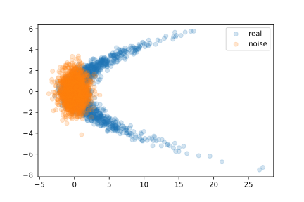
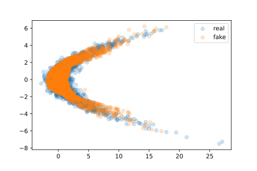
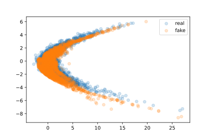
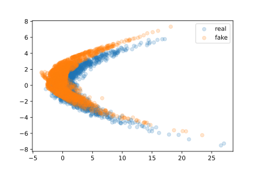
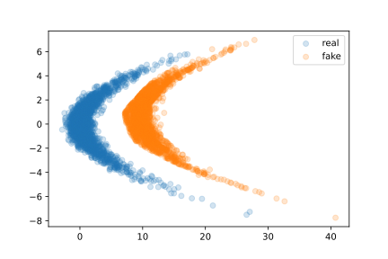
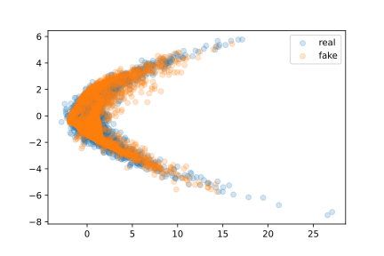
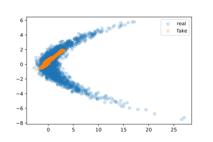
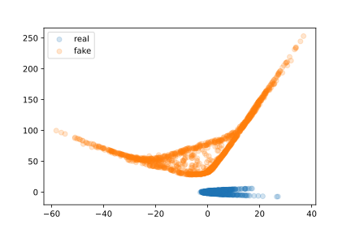
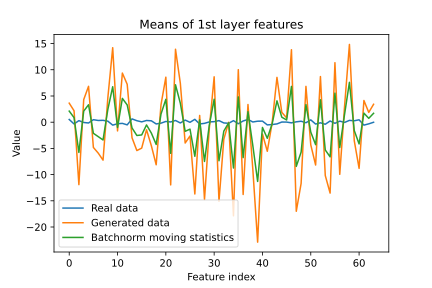
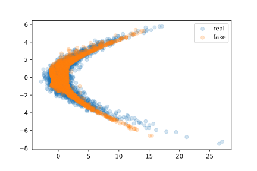

[Generative Adversarial Networks](https://proceedings.neurips.cc/paper/2014/file/5ca3e9b122f61f8f06494c97b1afccf3-Paper.pdf)
are one of the major categories of deep
generative models today, achieving very realistic high-resolution samples 
(such as [StyleGAN variants](https://arxiv.org/pdf/1912.04958.pdf)).
However, they also have a reputation of being difficult to train, with many "tricks"
being used to improve their stability.

One widely applicable technique to improve neural network optimization is [batch
normalization](http://proceedings.mlr.press/v37/ioffe15.pdf). When it was initially proposed, BN seemed like a simple way
to massively speed up training and improve performance, with very few downsides.
Over the years, however, cracks have begun to show: Why BN even works at all is
[debated](https://proceedings.neurips.cc/paper/2018/file/905056c1ac1dad141560467e0a99e1cf-Paper.pdf)
(also see [here](https://proceedings.neurips.cc/paper/2018/file/36072923bfc3cf47745d704feb489480-Paper.pdf)
or [here](https://arxiv.org/pdf/1809.00846.pdf)
or [here](https://www.researchgate.net/profile/Hadi-Daneshmand/publication/325413973_Towards_a_Theoretical_Understanding_of_Batch_Normalization/links/5b0fe4fe0f7e9b1ed704175a/Towards-a-Theoretical-Understanding-of-Batch-Normalization.pdf)...) 
and research has shown problematic behavior (e.g. [here](https://arxiv.org/pdf/2203.07976.pdf)).

BN and GANs are combined in some architectures, such as the popular reference
[DCGAN](https://arxiv.org/pdf/1511.06434.pdf). Although outdated, this still serves as an important go-to architecture
when starting to learn about GANs, with sample code being available on both the
[Tensorflow](https://www.tensorflow.org/tutorials/generative/dcgan) 
and [Pytorch](https://pytorch.org/tutorials/beginner/dcgan_faces_tutorial.html) 
websites. Notably, the DCGAN paper mentions that
they use BN, but not in the final generator layer nor in the first discriminator
layer, as this would cause unstable behavior. However, no explanations for this
behavior are given, nor why removing BN from those layers specifically should
fix it.

After running into strange issues and seemingly impossible behavior in my own
research involving GANs, I decided to further investigate how these networks
interact with BN. My findings up to this point are summarized in this blog.


## Setting The Stage

Let's train a small GAN on a simple toy dataset. See the dataset below; the goal
is to learn a generator `G` that essentially transforms noise (drawn from a 2D
standard normal distribution in this case, although this could be any distribution
at all) into data samples. We will use Tensorflow/Keras, although none of the
issues discussed in this post are framework-specific.



First, we set up simple networks for `G` and `D`:

```python
generator = tf.keras.Sequential(
    [tfkl.Dense(64),
     tfkl.LeakyReLU(alpha=0.01),
     tfkl.Dense(64),
     tfkl.LeakyReLU(alpha=0.01),
     tfkl.Dense(2)], name="generator")

discriminator = tf.keras.Sequential(
    [tfkl.Dense(64),
     tfkl.LeakyReLU(alpha=0.01),
     tfkl.Dense(64),
     tfkl.LeakyReLU(alpha=0.01),
     tfkl.Dense(1)], name="discriminator")
```

We can train the GAN like this:

```python
def train_step(real_batch):
    n_batch = tf.shape(real_batch)[0]
    noise = tf.random.normal([n_batch, 2])
    real_labels = tf.ones([n_batch, 1])
    fake_labels = tf.zeros([n_batch, 1])
    
    # train g
    with tf.GradientTape() as g_tape:
        fake_batch = generator(noise, training=True)
        d_out_deception = discriminator(fake_batch, training=True)
        deception_loss = -1 * loss_fn(fake_labels, d_out_deception)
    g_grads = g_tape.gradient(deception_loss, generator.trainable_variables)
    g_opt.apply_gradients(zip(g_grads, generator.trainable_variables))
    
    # train d
    with tf.GradientTape() as d_tape:
        d_out_fake = discriminator(fake_batch, training=True)
        d_out_real = discriminator(real_batch, training=True)
        d_loss = 0.5 * (loss_fn(real_labels, d_out_real) + loss_fn(fake_labels, d_out_fake))
    d_grads = d_tape.gradient(d_loss, discriminator.trainable_variables)
    d_opt.apply_gradients(zip(d_grads, discriminator.trainable_variables))
    
    return -deception_loss, d_loss
```

`D` is trained to classify real samples as 1 and fake samples as 0, guided by a
standard classification loss (binary cross-entropy). `G` is trained to maximize
this loss. We alternate one step of training `G` and one step of training `D`.
The goal is for the networks to reach an equilibrium point where the distribution
of samples generated by `G` matches the data distribution, and `D` outputs 0.5
for real and fake samples alike (that is, it "classifies" with maximum uncertainty).
We run this training for 2000 steps using [Adam](https://arxiv.org/pdf/1412.6980.pdf).
Note that we always put in
the full population (2048 samples) as the batch in each training step. Here are
the resulting samples:



As we can see, the generated samples match the data quite well. The loss for `D`
in this case is around `ln(2) ~= 0.69`, which indicates outputs of 0.5 for all samples,
as desired.


## Introducing Batch Normalization

Now let's add BN to our models. Of course, we don't actually need to do this for
this simple experiment, but let us assume we want to scale up our experiments to
more complex data/networks, where BN could be helpful[^1].

[^1]: Whether or not `G` includes BN is not relevant here.

```python
discriminator = tf.keras.Sequential(
    [tfkl.Dense(64),
     tfkl.BatchNormalization(),
     tfkl.LeakyReLU(alpha=0.01),
     tfkl.Dense(64),
     tfkl.BatchNormalization(),
     tfkl.LeakyReLU(alpha=0.01),
     tfkl.Dense(1)], name="discriminator")
```

We train the network in the exact same way as before and get this result:



It doesn't look quite right, does it? Almost seems like the entire distribution
is slightly shifted. Knowing that GANs have stability issues, we might just try
again with a new initialization:



Now it's definitely shifted in a different direction! And yet, in both cases,
the observed loss is again around `ln(2)`, indicating that `D` cannot tell the
distributions apart at all.


## Encouraging Distribution Shift

Let's make the issue more obvious. We slightly change the loss used to train `G`
like this:  

`deception_loss -= 0.005*tf.reduce_mean(fake_batch[:, 0])` 

This additional loss term encourages the generator to shift its
generated samples positively on the x-axis (i.e. to the right). 

The scaling is
hand-tuned: It must be large enough to actually produce relevant gradients for
the network, but if it is too large, `G` will essentially just ignore the
adversarial game and infinitely decrease the loss by moving its samples further
and further to the right. Empirically, with the scaling chosen as it is, `G` will _not_
shift the samples if this causes it to lose out in the adversarial game (i.e. `D`
easily tells the distributions apart since one is shifted). `G` will only shift
samples if it can somehow do this without `D` noticing.

Using this loss, we get the results below:



This time, the shift is very obvious. Still, `D` still incurs a loss of `ln(2)`,
meaning it is completely fooled by the generated samples!
Interestingly, if we remove BN but keep the additional loss term, we get this
result:



No shift has occurred! It seems that without BN, `D` picks up on the shift and
the resulting worse loss for `G` causes it to keep the samples where they should be.


## Oh God, What Is Going On

It seems like our `D` is somehow blind to shifts in the data. The overall shape
looks good, just not the location! The issue here is actually quite obvious when
we take another look at the training code for `D`:

```python
# train d
with tf.GradientTape() as d_tape:
    d_out_fake = discriminator(fake_batch, training=True)
    d_out_real = discriminator(real_batch, training=True)
    d_loss = 0.5 * (loss_fn(real_labels, d_out_real) + loss_fn(fake_labels, d_out_fake))
d_grads = d_tape.gradient(d_loss, discriminator.trainable_variables)
d_opt.apply_gradients(zip(d_grads, discriminator.trainable_variables))
```

Note that we put the real and fake samples into `D` separately. Recall that BN
normalizes features using _batch_ statistics. This means that the real samples
will be normalized to mean 0 and variance of 1, and the fake samples will also be
normalized to mean 0 and variance of 1[^2].

[^2]: To be precise, the _features_ after the dense layers are normalized. However,
these are just linear transformations, so the (also linear) normalization happening after the first
dense layer, but before the non-linearity, results in the same phenomenon.

This means that, if the fake samples are transformed by an affine-linear function
(shifted and/or scaled by a constant), this will be normalized away by `D`, making
it completely insensitive to such differences between distributions! In case this
is not quite understandable yet, here is a simple example:

Say, you have two "real" and two "fake" samples with only a single feature. E.g.
`a_real = [0.5, 1.5]` and `a_fake = [6., 8.]`. It would be very easy to tell these
two apart. However, when each batch is normalized separately with their respective
mean and standard deviation, they _both_ result in `[-1, 1]`! Thus, any model
working with the normalized data can never tell the two batches apart.

This is quite disastrous, as it means that `G` does not actually have to match
the real data properly. Here, we have only seen affine-linear shifts being undetected.
However, since BN is usually applied in _all_ layers, it may be that higher-order
differences between the distributions could also be normalized away in deeper layers
(but so far, I have not been able to show this experimentally).


## How Do We Fix This?

In the simple example above, what if we combine the two batches into one? Using
`a = [0.5, 1.5, 6., 8.]` and normalizing this, we get 
`[-1.12815215, -0.80582296,  0.64465837,  1.28931674]`. As we can see, it is still
easy to tell apart real and fake samples, e.g. with a threshold at 0.

This implies a straightforward solution: Use _joint_ batches to train
`D` instead[^3]!
This is what the training step for `D` would look like: 

[^3]: Note that reference implementations such as the Tensorflow/Pytorch DCGAN
code use split batches!

```python
# train d
with tf.GradientTape() as d_tape:
    combined_batch = tf.concat([fake_batch, real_batch], axis=0)
    combined_labels = tf.concat([fake_labels, real_labels], axis=0)
    d_out_fake = discriminator(combined_batch, training=True)
    d_loss = loss_fn(combined_labels, d_out_fake)
d_grads = d_tape.gradient(d_loss, discriminator.trainable_variables)
d_opt.apply_gradients(zip(d_grads, discriminator.trainable_variables))
```
We train a model (with BN and without the additional loss term) 
with this and get the results below.



Oh no... This looks bad. Even stranger, the losses are 6.62 for `G` and 0.17 for `D`.
Remember the equilibrium point 0.69? The loss for `G` is _higher_ indicating that
it's "winning" the game against `D`. At the same time, the loss for `D` is _lower_,
indicating that it's also winning! How can this be possible?

### A Step Back
Clearly, the above issue must be related to joint batches somehow, as that was the
only change we made. Let us forget about those for a moment and just go back to
split batches. Instead, I want to show the issue that originally made me launch
this investigation. With the training step for `D` being as before (split batches),
let's look at the code for `G` instead, specifically the role of `D`: 

```python
# train g
with tf.GradientTape() as g_tape:
    fake_batch = generator(noise, training=True)
    d_out_deception = discriminator(fake_batch, training=True)
    deception_loss = -1 * loss_fn(fake_labels, d_out_deception)
g_grads = g_tape.gradient(deception_loss, generator.trainable_variables)
g_opt.apply_gradients(zip(g_grads, generator.trainable_variables))
```

We are calling `D` with `training=True`. But if you think about it, we aren't really
training `D` here, are we? What if we just set `training=False`? It seems more
appropriate. Well, we get results like below:



This is even worse than above! Losses are 4.23 (`G`) and 0.007 (`D`), once again 
indicating that
both networks seem to be winning the game at the same time. I want to stress that
this is really not possible since we use the standard "zero-sum" formulation of
the GAN game[^4].
The only explanation is that somehow, `G` and `D` must be playing different games.
Let's finally try to fix this.

[^4]: To be precise, for `G` we are only using half the loss (only on generated
samples). However, since the `D` loss is the average between that and the loss
on real samples, if the `G` loss is, say, 4, the `D` loss would have to be at 
least 2.

### A Reminder About Batchnorm
Both failures shown above _have to_ be related to Batchnorm:
1. Batchnorm is the only thing in `D` that introduces dependencies between batch
elements, possibly causing different behavior between using joint or split batches.
2. Batchnorm is the only thing in `D` that has different behavior between `training`
being `True` or `False`.
   
Specifically, during training, Batchnorm uses batch statistics to normalize
features. During inference, however, this is undesirable as you
don't want predictions for one element to depend on those for other elements --
you might not even have batches to run on, just single examples! For this reason,
Batchnorm also keeps a moving average of batch statistics. As such, batch statistics
are accumulated over the course of training, and when using `training=False` these
accumulated statistics are used for normalization instead. This gives us a hint why
approach 2 above didn't work: There must be some difference between batch statistics
and accumulated statistics.

### The Issue With Approach 2
When using split batches for training `D`, both real and generated samples are 
normalized using their respective batch statistics. At the same time, these batch
statistics are used to update the moving average population statistics. However,
we only have _one set_ of such statistics, while the real and generated statistics
will likely be quite different (especially early in training). This results in
the moving averages to be somewhere between the real and generated statistics, as
exemplified below using the means:



When training `G` with `training=False` in `D`, these accumulated statistics are
used to normalize the generated batch input in `D`. But since these statistics do _not_ match
the generated batch statistics, the inputs are not properly normalized! This issue gets worse
in every layer that uses BN, and leads to `D` with `training=False` to essentially
be a _different function_ than with `training=True`. And this, finally, solves the
riddle of how both networks can "win" at the same time: `G` is basically playing
a different game! Clearly, we cannot train our GAN like this.

### The Issue With Approach 1
Remember that using joint batches for `D` did not work, either. The issue is actually
similar: When training `D`, features are normalized using the statistics of the joint 
batch. But when training `G`, we usually only feed a generated batch, which, of course,
has different statistics. Again, this causes a mismatch between the `D` that is
being trained, and the `D` that `G` trains on.


## How Do We _Actually_ Fix This?

Clearly, we have to resolve this mismatch somehow. Funnily enough, one possible fix
is to actually _combine_ the two approaches that did not work, i.e. `D` with 
`training=False` when training `G`, and joint batches for training `D`. The code
then looks like this:

```python
# train g
with tf.GradientTape() as g_tape:
    fake_batch = generator(noise, training=True)
    d_out_deception = discriminator(fake_batch, training=False)
    deception_loss = -1 * loss_fn(fake_labels, d_out_deception)
g_grads = g_tape.gradient(deception_loss, generator.trainable_variables)
g_opt.apply_gradients(zip(g_grads, generator.trainable_variables))

# train d
with tf.GradientTape() as d_tape:
    combined_batch = tf.concat([fake_batch, real_batch], axis=0)
    combined_labels = tf.concat([fake_labels, real_labels], axis=0)
    d_out_fake = discriminator(combined_batch, training=True)
    d_loss = loss_fn(combined_labels, d_out_fake)
d_grads = d_tape.gradient(d_loss, discriminator.trainable_variables)
d_opt.apply_gradients(zip(d_grads, discriminator.trainable_variables))
```

Now, when training `D`, the batches are normalized using the joint statistics. Also,
the statistics of both real and fake samples are accumulated into the moving average.
When training `G`, we only pass a generated batch to `D`, but because we set `training=False`,
the accumulated statistics are used, not the ones of the batch. Finally, the mismatch
is resolved! As we can see below, the model produces good samples, and it is
even "immune" to affine-linear shifts in the data (like the original model without BN)
due to the joint batch normalization.




### It's Not Over Yet...
Unfortunately, while the above works well for this simple toy example, I have
still observed issues with both networks "winning" at the same time 
in larger-scale experiments. This implies that there must still be a mismatch in
the normalization. Most likely, the accumulated population statistics (which are
updated with a slow-moving average) lag behind the current batch statistics, especially
early in training when the model parameters change rapidly. This could perhaps be
fixed by making the average move faster, but this would make the population statistics
more volatile and may reduce inference performance. To finish our investigation,
I would like to discuss a few more possible solutions:

1. Also pass a joint batch to `D` when training `G`, and using `training=True`
again. This guarantees consistent behavior in `D` for both training steps.
   The only annoyance is that this requires additional computation,
   as we have to put an entire real batch through `D` that we otherwise wouldn't
   need, and that doesn't influence the training of `G` directly (except through
   the changed statistics).
2. Don't use BN. Overall, it seems like BN is falling out of favor somewhat. This
likely has to do with the fact that models are getting bigger and bigger, being
    trained on many GPUs in parallel, and BN is not effective for small batches.
    Instead, other normalization methods can be used, such as Weight, Layer, Instance
    or Group Normalization. None of these methods introduce dependencies within a
    batch, and thus should produce less "strange" behaviors.
    However, another takeaway of this post should be that you have to think about
    what kind of information is "normalized away". Remember that the original issue
    was that BN caused `D` to ignore affine-linear shifts (at the population level)
    in the data. If we look at Instance Normalization, this should be even worse,
    as it would normalize affine-linear shifts even at the _instance_ level.
    However, since IN only makes sense for data with spatial dimensions (images etc),
    we cannot test it in the simple framework used for this post. This may be
    content for follow-up work. Layernorm, on the other hand, seems to be able to
    detect these shifts (why/how exactly, I still have to think about), and thus
    Groupnorm should, as well. Finally, Weightnorm doesn't modify the features at
    all, so it should have no issues.
3. Don't use BN in the first layer of `D`. This prevents the "normalizing away"
of affine-linear shifts, and the first-layer features can pick up on them and
   "preserve" them throughout the network. The DCGAN paper, for example, simply
   states that they did this (also removing BN from the final layer of `G`) because
   the training would otherwise be unstable. However, they do not offer any explanations
   for _why_ BN may be harmful. The question for me is whether BN in later layers
   could still be problematic, since it might normalize away "higher-order" differences
   in features that have the same mean and variance, but differ in higher moments.
   

### A Bonus Experiment
Recall that our "broken" training attempts were caused by a mismatch between the
distributions of the real and fake samples. Batchnorm normalizes
the mean and variance. What if we force those to be the same between the distributions?
Specifically, we transform our generated samples like this:

```python
train_real_means, train_real_vars = tf.nn.moments(x_samples, axes=[0])
train_fake_means, train_fake_vars = tf.nn.moments(fake_batch, axes=[0])

fake_batch = (fake_batch - train_fake_means) / tf.math.sqrt(train_fake_vars)
fake_batch = fake_batch * tf.math.sqrt(train_real_vars) + train_real_means
```

Essentially, this works like a batchnorm layer with `beta` and `gamma` fixed to
the statistics of the real data. Since we now force the statistics of the generated
samples to equal the real data, there should be no more distribution differences, right?

Sort of. This actually works, _if_ `D` has BN _only in the first layer_. It makes
sense when you think about it: We equalized the means and variances of the real
and fake data, so they will be "appropriately" normalized by the first-layer BN.
However, the _distributions_ are of course not identical; there will still be
differences in higher moments. BN in later layers will still normalize these
away, but because we did not equalize them between the distributions, we once
again run into the old issues of `G` and `D` playing different games (samples
being normalized with different statistics). To me, this indicates that BN in
later layers can still be problematic, and just removing it from the first layer
(as recommended in the DCGAN paper) may not be sufficient.


## Takeaways

So is BN terrible and useless? Probably not. The issues discussed here only arise
due to us training with two distinct populations (real and generated data). BN
will likely still work well in many standard tasks in discriminative and generative
modeling.

However, I think it's important to be aware of the implications of normalizing
this or that, _completely_ removing certain information from your model in the process.
In my personal experience, most normalization techniques are somewhat situational,
and it is rarely clear in advance which one will work best for a certain task or
model. Getting an idea of their respective quirks, however, can limit the search
space and save lots of time.

And stay away from GANs, kids. ;)
